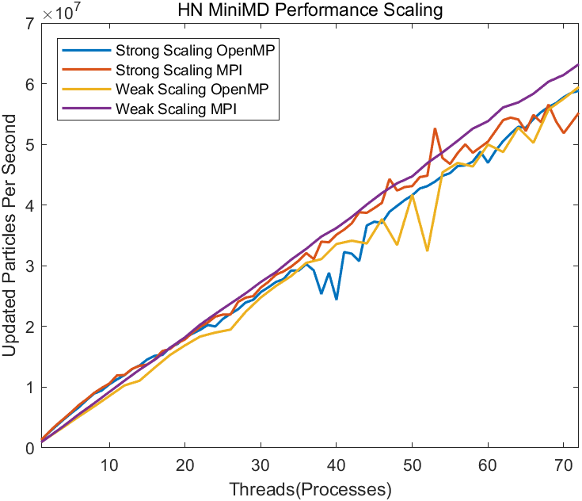

# Performance Analysis of MiniMD

## Project Description

### Author Information

* Name: Jinwen Pan
* E-Mail: [isjinwen.pan@gmail.com](mailto:isjinwen.pan@gmail.com)

### Application Information

* Code: MiniMD
* URL: https://github.com/RRZE-HPC/miniMD

MiniMD is a molecular dynamics simulation mini-application in the Mantevo project at Sandia National Laboratories. The primary authors of MiniMD are Steve Plirnpton, Paul Crozier, and Christian Trott. 

MiniMD consisting of less than 5000 lines of C++ code is a miniature version of the molecular dynamics application LAMMPS. They both utilize the spatial decomposition algorithm. And MiniMD enables users to specify problem size, atom density, temperature, timestep size, number of timesteps to perform, and particle interaction cutoff distance. 

MiniMD is based on Newtonian Mechanics. Lennard-Jones Potential and Embedded Atom Model Potential are available in MiniMD for force calculation. And either half or full neighbor list approach is used to approximate the number of particles considered. 

### Testsystem

* Host/Clustername: Fritz
* Cluster Info URL: <https://hpc.fau.de/systems-services/documentation-instructions/clusters/fritz-cluster/>
* CPU name: Intel(R) Xeon(R) Platinum 8360Y CPU @ 2.40GHz
* CPU type: Intel Icelake SP Processor
* 944 compute nodes: 2 sockets per node and 36 cores per socket
* 4 NUMA domains per node: 18 cores per domain (Cluster On Die / SNC active)
* One thread per core: SMT is not active
* Cache: Each core has an individual L1 cache (48 KB) and L2 cache (1.25 MB) and each socket has an individual L3 cache (54 MB)
* Memory capacity: 256 GB

### Software Environment

**Compiler**:

* Intel/2021.4.0
* Intelmpi/2021.4.0
* Operating System: AlmaLinux release 8.6 (Sky Tiger)
* Addition libraries:
  * LIKWID 5.2.1

**Note:** Intel now provides two different compilers. The good-old `icc`/`icpc`/`ifort` compilers and the new `icx`/`icpx`/`ifx`. They are different in their capabilities and options. We select `icc` here and stay with the same compiler.

### How to build software

```
$ module load intel/2021.4.0
$ module load intelmpi/2021.4.0
$ module load likwid/5.2.1
$ make
```

**Note:** There are some options available in the makefile we can select: 
- `-Ofast`: This option will not strictly follow language standards and will specifically optimize for some languages in addition to enabling all `-O3` optimization options.
- `-no-vec`: No vectorization is utilized
- `-xSSE4.2`: Enables SSE vectorization 
- `-xCORE-AVX2`: Enables AVX2 vectorization (Intel only)
- `-xCORE-AVX512` and `-qopt-zmm-usage=high`: Force usage of AVX512 instructions (Intel only)

For scaling runs, we always ultilize AVX512 instructions. Afterwards, we will test different types of vectorizations.  

### Testcase description

The testcase can be defined by the file `in.lj.miniMD`. The default content is:
```
Lennard-Jones input file for miniMD

lj             units (lj or metal)
none           data file (none or filename)
lj  	       force style (lj or eam)
1.0 1.0        LJ parameters (epsilon and sigma; COMD: 0.167 / 2.315)
32 32 32       size of problem
100            timesteps
0.005          timestep size
1.44           initial temperature
0.8442         density
20             reneighboring every this many steps
2.5 0.30       force cutoff and neighbor skin
100            thermo calculation every this many steps (0 = start,end)
```

In our benchmarks, we only consider LJ potential. The number of particles equals to the product of problem sizes in 3D times 4. Problem sizes can also be specified in the command line with `-nx X -ny Y -nz Z` or `-s S` if they are unified in 3D. Apart from that, we also specify half or full neighbor list algorithm in the command line with `--half_neigh 1` or `--half_neigh 0` (default is half neighbor list). And the other test parameters will not be modified during the benchmarks. 

### How to run software

```
$ module load intel/2021.4.0
$ module load intelmpi/2021.4.0
$ module load likwid/5.2.1
$ make
$ cd ./data
$ mpirun -np X ../miniMD-ICC -s 48
```
The running command above is just an example. Actually we will use `sbatch` or `srun` to run the program and present different scripts for different testcases later. Here are some options used in the scripts:
- `--cpu-freq=2400000`: Fixes the cpu frequency at 2.4GHz
- `-np`: Specifies the number of processes
- `--num_threads`: Specifies the number of threads
- `-pin`: Pins the program on some cores
- `-g FLOPS_DP`: Measures FLOPS_DP performance group
- `-m`: Enables MarkerAPI mode

## Task1: Scaling runs
We perform strong and weak scaling runs for full and half neighbor list variants with OpenMP or MPI. 

For OpenMP, we ultilize at most 72 cores on one node. For MPI, we also ultilize at most 72 cores on one node for comparison with OpenMP. In addition, we also ultilize at most 20 nodes and fully use each node with MPI. 

Apart from the runtime, in MiniMD, the performance index is the number of updated particles per second. For scaling runs, we also calculate the speed-up and parallel efficiency based on the runtime. 


We plot them with MATLAB:
```
plot(x1,y11,x1,y12,x2,y21,x2,y22,'linewidth',1.5);
xlabel('Threads(Processes)');
ylabel('Updated Particles Per Second');
xlim([1,72]);
legend('Strong Scaling OpenMP','Strong Scaling MPI','Weak Scaling OpenMP','Weak Scaling MPI');
title('MiniMD Performance Scaling');
```




For strong scalings here, the problem size is 48 x 48 x 48, and for weak scalings, the basic problem size is 16 x 16 x 16. 

The data show that the code is not limited by the memory bandwidth except for the strong scaling of FN MiniMD with MPI and the performance weak scalings of both MiniMD variants with MPI are a little bit better than the other cases.


Generally, parallel efficiency of weak scalings is higher than that of strong scalings. For weak scalings, MPI has higher parallel efficiency for both variants of MiniMD. For strong scalings, the parallel efficiency decreases quickly when ultilizing 1 to 15 threads(processes). 

Apart from that, we also perform scaling runs on multi-node with MPI:


Here, for strong scalings, the problem size is 144 x 144 x 144, and for weak scalings, the basic problem size is 32 x 32 x 32. In general, parallel efficiency of MiniMD has a better scalability on multi-node than on a single node. 

## Task2: Whole application measurements

We are interested in the effectiveness of SIMD vectorization of MiniMD. So afterwards, we will perform sequential tests but with different types of vectorizations, which can be done by modifying the makefile. And we only consider LIKWID performance group `FLOPS_DP`. 

**Note:** The data below are just for recording and for the whole application, so the conclusions are not that obvious. We will mark and analyze the hot spots later. 

```
$ srun --constraint=hwperf likwid-perfctr -g FLOPS_DP -C S0:1 ../miniMD-novec --half_neigh 1
+------------------------------------------+---------+--------------+
|                   Event                  | Counter |  HWThread 1  |
+------------------------------------------+---------+--------------+
|             INSTR_RETIRED_ANY            |  FIXC0  | 104418536072 |
|           CPU_CLK_UNHALTED_CORE          |  FIXC1  |  60430143542 |
|           CPU_CLK_UNHALTED_REF           |  FIXC2  |  44720803776 |
|               TOPDOWN_SLOTS              |  FIXC3  | 302150717710 |
| FP_ARITH_INST_RETIRED_128B_PACKED_DOUBLE |   PMC0  |            0 |
|    FP_ARITH_INST_RETIRED_SCALAR_DOUBLE   |   PMC1  |  42717595673 |
| FP_ARITH_INST_RETIRED_256B_PACKED_DOUBLE |   PMC2  |            0 |
| FP_ARITH_INST_RETIRED_512B_PACKED_DOUBLE |   PMC3  |            0 |
+------------------------------------------+---------+--------------+
+----------------------+------------+
|        Metric        | HWThread 1 |
+----------------------+------------+
|  Runtime (RDTSC) [s] |    19.6449 |
| Runtime unhalted [s] |    25.2387 |
|      Clock [MHz]     |  3235.4168 |
|          CPI         |     0.5787 |
|     DP [MFLOP/s]     |  2174.4912 |
|   AVX DP [MFLOP/s]   |          0 |
|  AVX512 DP [MFLOP/s] |          0 |
|   Packed [MUOPS/s]   |          0 |
|   Scalar [MUOPS/s]   |  2174.4912 |
|  Vectorization ratio |          0 |
+----------------------+------------+
```

```
$ srun --constraint=hwperf likwid-perfctr -g FLOPS_DP -C S0:1 ../miniMD-SSE --half_neigh 1
+------------------------------------------+---------+--------------+
|                   Event                  | Counter |  HWThread 1  |
+------------------------------------------+---------+--------------+
|             INSTR_RETIRED_ANY            |  FIXC0  | 125318909039 |
|           CPU_CLK_UNHALTED_CORE          |  FIXC1  |  64632221838 |
|           CPU_CLK_UNHALTED_REF           |  FIXC2  |  47514815520 |
|               TOPDOWN_SLOTS              |  FIXC3  | 323161109190 |
| FP_ARITH_INST_RETIRED_128B_PACKED_DOUBLE |   PMC0  |  19839690229 |
|    FP_ARITH_INST_RETIRED_SCALAR_DOUBLE   |   PMC1  |   7832120985 |
| FP_ARITH_INST_RETIRED_256B_PACKED_DOUBLE |   PMC2  |            0 |
| FP_ARITH_INST_RETIRED_512B_PACKED_DOUBLE |   PMC3  |            0 |
+------------------------------------------+---------+--------------+
+----------------------+------------+
|        Metric        | HWThread 1 |
+----------------------+------------+
|  Runtime (RDTSC) [s] |    20.9263 |
| Runtime unhalted [s] |    26.9937 |
|      Clock [MHz]     |  3256.9114 |
|          CPI         |     0.5157 |
|     DP [MFLOP/s]     |  2270.4219 |
|   AVX DP [MFLOP/s]   |          0 |
|  AVX512 DP [MFLOP/s] |          0 |
|   Packed [MUOPS/s]   |   948.0750 |
|   Scalar [MUOPS/s]   |   374.2719 |
|  Vectorization ratio |    71.6964 |
+----------------------+------------+
```

```
$ srun --constraint=hwperf likwid-perfctr -g FLOPS_DP -C S0:1 ../miniMD-AVX2 --half_neigh 1
+------------------------------------------+---------+--------------+
|                   Event                  | Counter |  HWThread 1  |
+------------------------------------------+---------+--------------+
|             INSTR_RETIRED_ANY            |  FIXC0  | 110110097793 |
|           CPU_CLK_UNHALTED_CORE          |  FIXC1  |  62375643274 |
|           CPU_CLK_UNHALTED_REF           |  FIXC2  |  46112232768 |
|               TOPDOWN_SLOTS              |  FIXC3  | 311878216370 |
| FP_ARITH_INST_RETIRED_128B_PACKED_DOUBLE |   PMC0  |  20468208663 |
|    FP_ARITH_INST_RETIRED_SCALAR_DOUBLE   |   PMC1  |   7832111825 |
| FP_ARITH_INST_RETIRED_256B_PACKED_DOUBLE |   PMC2  |     67129344 |
| FP_ARITH_INST_RETIRED_512B_PACKED_DOUBLE |   PMC3  |            0 |
+------------------------------------------+---------+--------------+
+----------------------+------------+
|        Metric        | HWThread 1 |
+----------------------+------------+
|  Runtime (RDTSC) [s] |    20.2991 |
| Runtime unhalted [s] |    26.0513 |
|      Clock [MHz]     |  3238.7995 |
|          CPI         |     0.5665 |
|     DP [MFLOP/s]     |  2415.7195 |
|   AVX DP [MFLOP/s]   |    13.2280 |
|  AVX512 DP [MFLOP/s] |          0 |
|   Packed [MUOPS/s]   |  1011.6355 |
|   Scalar [MUOPS/s]   |   385.8345 |
|  Vectorization ratio |    72.3905 |
+----------------------+------------+
```

```
$ srun --constraint=hwperf likwid-perfctr -g FLOPS_DP -C S0:1 ../miniMD-AVX512 --half_neigh 1
+------------------------------------------+---------+--------------+
|                   Event                  | Counter |  HWThread 1  |
+------------------------------------------+---------+--------------+
|             INSTR_RETIRED_ANY            |  FIXC0  |  41681830771 |
|           CPU_CLK_UNHALTED_CORE          |  FIXC1  |  31771746363 |
|           CPU_CLK_UNHALTED_REF           |  FIXC2  |  25198823808 |
|               TOPDOWN_SLOTS              |  FIXC3  | 158858731815 |
| FP_ARITH_INST_RETIRED_128B_PACKED_DOUBLE |   PMC0  |     14775996 |
|    FP_ARITH_INST_RETIRED_SCALAR_DOUBLE   |   PMC1  |   6597572049 |
| FP_ARITH_INST_RETIRED_256B_PACKED_DOUBLE |   PMC2  |            0 |
| FP_ARITH_INST_RETIRED_512B_PACKED_DOUBLE |   PMC3  |   8896278323 |
+------------------------------------------+---------+--------------+
+----------------------+------------+
|        Metric        | HWThread 1 |
+----------------------+------------+
|  Runtime (RDTSC) [s] |    11.4680 |
| Runtime unhalted [s] |    13.2696 |
|      Clock [MHz]     |  3018.8747 |
|          CPI         |     0.7622 |
|     DP [MFLOP/s]     |  6783.8793 |
|   AVX DP [MFLOP/s]   |  6205.9983 |
|  AVX512 DP [MFLOP/s] |  6205.9983 |
|   Packed [MUOPS/s]   |   777.0382 |
|   Scalar [MUOPS/s]   |   575.3041 |
|  Vectorization ratio |    57.4587 |
+----------------------+------------+
```

```
$ srun --constraint=hwperf likwid-perfctr -g FLOPS_DP -C S0:1 ../miniMD-novec --half_neigh 0
+------------------------------------------+---------+--------------+
|                   Event                  | Counter |  HWThread 1  |
+------------------------------------------+---------+--------------+
|             INSTR_RETIRED_ANY            |  FIXC0  | 168247109318 |
|           CPU_CLK_UNHALTED_CORE          |  FIXC1  | 108931205395 |
|           CPU_CLK_UNHALTED_REF           |  FIXC2  |  77746826688 |
|               TOPDOWN_SLOTS              |  FIXC3  | 544656026975 |
| FP_ARITH_INST_RETIRED_128B_PACKED_DOUBLE |   PMC0  |            0 |
|    FP_ARITH_INST_RETIRED_SCALAR_DOUBLE   |   PMC1  |  74783464037 |
| FP_ARITH_INST_RETIRED_256B_PACKED_DOUBLE |   PMC2  |            0 |
| FP_ARITH_INST_RETIRED_512B_PACKED_DOUBLE |   PMC3  |            0 |
+------------------------------------------+---------+--------------+
+----------------------+------------+
|        Metric        | HWThread 1 |
+----------------------+------------+
|  Runtime (RDTSC) [s] |    33.4358 |
| Runtime unhalted [s] |    45.4953 |
|      Clock [MHz]     |  3354.7131 |
|          CPI         |     0.6474 |
|     DP [MFLOP/s]     |  2236.6283 |
|   AVX DP [MFLOP/s]   |          0 |
|  AVX512 DP [MFLOP/s] |          0 |
|   Packed [MUOPS/s]   |          0 |
|   Scalar [MUOPS/s]   |  2236.6283 |
|  Vectorization ratio |          0 |
+----------------------+------------+
```

```
$ srun --constraint=hwperf likwid-perfctr -g FLOPS_DP -C S0:1 ../miniMD-SSE --half_neigh 0
+------------------------------------------+---------+--------------+
|                   Event                  | Counter |  HWThread 1  |
+------------------------------------------+---------+--------------+
|             INSTR_RETIRED_ANY            |  FIXC0  | 170410422865 |
|           CPU_CLK_UNHALTED_CORE          |  FIXC1  |  74269282296 |
|           CPU_CLK_UNHALTED_REF           |  FIXC2  |  54132365472 |
|               TOPDOWN_SLOTS              |  FIXC3  | 371346411480 |
| FP_ARITH_INST_RETIRED_128B_PACKED_DOUBLE |   PMC0  |  35330002633 |
|    FP_ARITH_INST_RETIRED_SCALAR_DOUBLE   |   PMC1  |  12870242197 |
| FP_ARITH_INST_RETIRED_256B_PACKED_DOUBLE |   PMC2  |            0 |
| FP_ARITH_INST_RETIRED_512B_PACKED_DOUBLE |   PMC3  |            0 |
+------------------------------------------+---------+--------------+
+----------------------+------------+
|        Metric        | HWThread 1 |
+----------------------+------------+
|  Runtime (RDTSC) [s] |    23.6667 |
| Runtime unhalted [s] |    31.0185 |
|      Clock [MHz]     |  3285.0358 |
|          CPI         |     0.4358 |
|     DP [MFLOP/s]     |  3529.4452 |
|   AVX DP [MFLOP/s]   |          0 |
|  AVX512 DP [MFLOP/s] |          0 |
|   Packed [MUOPS/s]   |  1492.8162 |
|   Scalar [MUOPS/s]   |   543.8128 |
|  Vectorization ratio |    73.2984 |
+----------------------+------------+
```

```
$ srun --constraint=hwperf likwid-perfctr -g FLOPS_DP -C S0:1 ../miniMD-AVX2 --half_neigh 0
+------------------------------------------+---------+--------------+
|                   Event                  | Counter |  HWThread 1  |
+------------------------------------------+---------+--------------+
|             INSTR_RETIRED_ANY            |  FIXC0  |  97062726368 |
|           CPU_CLK_UNHALTED_CORE          |  FIXC1  |  47283259883 |
|           CPU_CLK_UNHALTED_REF           |  FIXC2  |  35625824832 |
|               TOPDOWN_SLOTS              |  FIXC3  | 236416299415 |
| FP_ARITH_INST_RETIRED_128B_PACKED_DOUBLE |   PMC0  |    153249666 |
|    FP_ARITH_INST_RETIRED_SCALAR_DOUBLE   |   PMC1  |  13647444241 |
| FP_ARITH_INST_RETIRED_256B_PACKED_DOUBLE |   PMC2  |  19176164528 |
| FP_ARITH_INST_RETIRED_512B_PACKED_DOUBLE |   PMC3  |            0 |
+------------------------------------------+---------+--------------+
+----------------------+------------+
|        Metric        | HWThread 1 |
+----------------------+------------+
|  Runtime (RDTSC) [s] |    15.8394 |
| Runtime unhalted [s] |    19.7479 |
|      Clock [MHz]     |  3177.8148 |
|          CPI         |     0.4871 |
|     DP [MFLOP/s]     |  5723.6103 |
|   AVX DP [MFLOP/s]   |  4842.6466 |
|  AVX512 DP [MFLOP/s] |          0 |
|   Packed [MUOPS/s]   |  1220.3369 |
|   Scalar [MUOPS/s]   |   861.6133 |
|  Vectorization ratio |    58.6151 |
+----------------------+------------+
```

```
$ srun --constraint=hwperf likwid-perfctr -g FLOPS_DP -C S0:1 ../miniMD-AVX512 --half_neigh 0
+------------------------------------------+---------+--------------+
|                   Event                  | Counter |  HWThread 1  |
+------------------------------------------+---------+--------------+
|             INSTR_RETIRED_ANY            |  FIXC0  |  65539184431 |
|           CPU_CLK_UNHALTED_CORE          |  FIXC1  |  37412783632 |
|           CPU_CLK_UNHALTED_REF           |  FIXC2  |  29085433920 |
|               TOPDOWN_SLOTS              |  FIXC3  | 187063918160 |
| FP_ARITH_INST_RETIRED_128B_PACKED_DOUBLE |   PMC0  |     14788479 |
|    FP_ARITH_INST_RETIRED_SCALAR_DOUBLE   |   PMC1  |  12513661446 |
| FP_ARITH_INST_RETIRED_256B_PACKED_DOUBLE |   PMC2  |            0 |
| FP_ARITH_INST_RETIRED_512B_PACKED_DOUBLE |   PMC3  |  13946495531 |
+------------------------------------------+---------+--------------+
+----------------------+------------+
|        Metric        | HWThread 1 |
+----------------------+------------+
|  Runtime (RDTSC) [s] |    13.0671 |
| Runtime unhalted [s] |    15.6255 |
|      Clock [MHz]     |  3079.8612 |
|          CPI         |     0.5708 |
|     DP [MFLOP/s]     |  9498.2701 |
|   AVX DP [MFLOP/s]   |  8538.3630 |
|  AVX512 DP [MFLOP/s] |  8538.3630 |
|   Packed [MUOPS/s]   |  1068.4271 |
|   Scalar [MUOPS/s]   |   957.6437 |
|  Vectorization ratio |    52.7339 |
+----------------------+------------+
```

## Task3: Runtime profile

For the runtime profile, we commonly use `gprof` due to the already available support by the compilers. Afterwards, we normally run HF/FN MiniMD with single MPI process without vectorization: 
- `srun --constraint=hwperf likwid-perfctr -g FLOPS_DP -C S0:1 ../miniMD-novec --half_neigh 1 -s 48`
- `srun --constraint=hwperf likwid-perfctr -g FLOPS_DP -C S0:1 ../miniMD-novec --half_neigh 0 -s 48`

In the end, we run `gprof ../miniMD-novec gmon.out` to get the profiles:
```
HN MiniMD:
Each sample counts as 0.01 seconds.
  %   cumulative   self              self     total
 time   seconds   seconds    calls   s/call   s/call  name
 77.47     14.40    14.40      102     0.14     0.14  ForceLJ::compute(Atom&, Neighbor&, Comm&, int)
 17.21     17.60     3.20        6     0.53     0.53  Neighbor::build(Atom&)
  1.72     17.92     0.32        1     0.32    17.39  Integrate::run(Atom&, Force*, Neighbor&, Comm&, Thermo&, Timer&)
  1.56     18.21     0.29                             __intel_avx_rep_memcpy
  0.48     18.30     0.09      570     0.00     0.00  Atom::pack_comm(int, int*, double*, int*)
  0.38     18.37     0.07      612     0.00     0.00  Atom::unpack_reverse(int, int*, double*)
  0.27     18.42     0.05   442368     0.00     0.00  Atom::addatom(double, double, double, double, double, double)
  0.16     18.45     0.03        6     0.01     0.01  Comm::borders(Atom&)
  0.16     18.48     0.03   621194     0.00     0.00  Atom::unpack_border(int, double*)
  0.16     18.51     0.03      570     0.00     0.00  Atom::unpack_comm(int, int, double*)
```
```
FN MiniMD:
Each sample counts as 0.01 seconds.
  %   cumulative   self              self     total
 time   seconds   seconds    calls   s/call   s/call  name
 77.43     25.28    25.28      102     0.25     0.25  ForceLJ::compute(Atom&, Neighbor&, Comm&, int)
 19.57     31.67     6.39        6     1.07     1.07  Neighbor::build(Atom&)
  1.26     32.08     0.41        1     0.41    30.71  Integrate::run(Atom&, Force*, Neighbor&, Comm&, Thermo&, Timer&)
  0.74     32.32     0.24                             __intel_avx_rep_memcpy
  0.25     32.40     0.08        1     0.08     0.12  create_atoms(Atom&, int, int, int, double)
  0.18     32.46     0.06      570     0.00     0.00  Atom::pack_comm(int, int*, double*, int*)
  0.15     32.51     0.05        6     0.01     0.01  Comm::borders(Atom&)
  0.12     32.55     0.04   442368     0.00     0.00  Atom::addatom(double, double, double, double, double, double)
  0.06     32.57     0.02   622530     0.00     0.00  Atom::unpack_border(int, double*)
  0.06     32.59     0.02        6     0.00     0.00  Atom::pbc()
```
For both variants, the most consumable function is force calculation and they almost have the same proportion of the runtime. If we consider average consumed time for each call, we will find the function building the neighbor list consumes much more time than force computing function. 

## Task4: Instrument functions with MarkerAPI

At first, we have to include the header file, initialize and finalize the LIKWID MarkerAPI in the serial region (`./src/ljs.cpp`):

```
#include <likwid-marker.h>
LIKWID_MARKER_INIT;
LIKWID_MARKER_THREADINIT;
LIKWID_MARKER_REGISTER("HALF_NEIGH");
LIKWID_MARKER_REGISTER("FULL_NEIGH");
<code>
LIKWID_MARKER_CLOSE;
```

And then we will instrument the force computing functions for HF and FN MiniMD in `./src/force_lj.cpp`:

```
void ForceLJ::compute(Atom &atom, Neighbor &neighbor, Comm &comm, int me)
{
    eng_vdwl = 0;
    virial = 0;

    if(neighbor.halfneigh)
    {
        compute_halfneigh(atom, neighbor, me);
    } else {
        compute_fullneigh(atom, neighbor, me);
    }

    return;
}

void ForceLJ::compute_halfneigh(Atom &atom, Neighbor &neighbor, int me)
{
    int* neighs;
    const int nlocal = atom.nlocal;
    const int nall = atom.nlocal + atom.nghost;

    MMD_float* x = &atom.x[0][0];
    MMD_float* f = &atom.f[0][0];

#pragma omp barrier
    // clear force on own and ghost atoms
    OMPFORSCHEDULE
        for(int i = 0; i < nall; i++) {
            f[i * PAD + 0] = 0.0;
            f[i * PAD + 1] = 0.0;
            f[i * PAD + 2] = 0.0;
        }
    LIKWID_MARKER_START("HALF_NEIGH");
    // loop over all neighbors of my atoms
    // store force on both atoms i and j
    OMPFORSCHEDULE
        for(int i = 0; i < nlocal; i++) {
            neighs = &neighbor.neighbors[i * neighbor.maxneighs];
            const int numneighs = neighbor.numneigh[i];
            const MMD_float xtmp = x[i * PAD + 0];
            const MMD_float ytmp = x[i * PAD + 1];
            const MMD_float ztmp = x[i * PAD + 2];

            MMD_float fix = 0.0;
            MMD_float fiy = 0.0;
            MMD_float fiz = 0.0;

#ifdef USE_SIMD
#pragma simd reduction (+: fix,fiy,fiz)
#endif
            for(int k = 0; k < numneighs; k++) {
                const int j = neighs[k];
                const MMD_float delx = xtmp - x[j * PAD + 0];
                const MMD_float dely = ytmp - x[j * PAD + 1];
                const MMD_float delz = ztmp - x[j * PAD + 2];
                const MMD_float rsq = delx * delx + dely * dely + delz * delz;

                if(rsq < cutforcesq) {
                    const MMD_float sr2 = 1.0 / rsq;
                    const MMD_float sr6 = sr2 * sr2 * sr2 * sigma6;
                    const MMD_float force = 48.0 * sr6 * (sr6 - 0.5) * sr2 * epsilon;

                    fix += delx * force;
                    fiy += dely * force;
                    fiz += delz * force;

                    if(j < nlocal) {
#pragma omp atomic
                        f[j * PAD + 0] -= delx * force;
#pragma omp atomic
                        f[j * PAD + 1] -= dely * force;
#pragma omp atomic
                        f[j * PAD + 2] -= delz * force;
                    }
                }
            }

            f[i * PAD + 0] += fix;
            f[i * PAD + 1] += fiy;
            f[i * PAD + 2] += fiz;
        }
#pragma omp barrier
LIKWID_MARKER_STOP("HALF_NEIGH");
}

//optimised version of compute
//  -MPI + OpenMP (using full neighborlists)
//  -gets rid of fj update (read/write to memory)
//  -use temporary variable for summing up fi
//  -enables vectorization by:
//    -get rid of 2d pointers
//    -use pragma simd to force vectorization of inner loop
void ForceLJ::compute_fullneigh(Atom &atom, Neighbor &neighbor, int me)
{
    int* neighs;
    const int nlocal = atom.nlocal;
    const int nall = atom.nlocal + atom.nghost;

    MMD_float* x = &atom.x[0][0];
    MMD_float* f = &atom.f[0][0];
    int tid = omp_get_thread_num();

    x = &atom.x[0][0];
    f = &atom.f[0][0];
  #pragma omp barrier

    // clear force on own and ghost atoms
  OMPFORSCHEDULE
    for(int i = 0; i < nlocal; i++) {
        f[i * PAD + 0] = 0.0;
        f[i * PAD + 1] = 0.0;
        f[i * PAD + 2] = 0.0;
    }
  LIKWID_MARKER_START("FULL_NEIGH");
    // loop over all neighbors of my atoms
    // store force on atom i
  OMPFORSCHEDULE
    for(int i = 0; i < nlocal; i++) {
        neighs = &neighbor.neighbors[i * neighbor.maxneighs];
        const int numneighs = neighbor.numneigh[i];
        const MMD_float xtmp = x[i * PAD + 0];
        const MMD_float ytmp = x[i * PAD + 1];
        const MMD_float ztmp = x[i * PAD + 2];

        MMD_float fix = 0;
        MMD_float fiy = 0;
        MMD_float fiz = 0;

        for(int k = 0; k < numneighs; k++) {
            const int j = neighs[k];
            const MMD_float delx = xtmp - x[j * PAD + 0];
            const MMD_float dely = ytmp - x[j * PAD + 1];
            const MMD_float delz = ztmp - x[j * PAD + 2];
            const MMD_float rsq = delx * delx + dely * dely + delz * delz;

            if(rsq < cutforcesq) {
                const MMD_float sr2 = 1.0 / rsq;
                const MMD_float sr6 = sr2 * sr2 * sr2 * sigma6;
                const MMD_float force = 48.0 * sr6 * (sr6 - 0.5) * sr2 * epsilon;

                fix += delx * force;
                fiy += dely * force;
                fiz += delz * force;
            }
        }

        f[i * PAD + 0] += fix;
        f[i * PAD + 1] += fiy;
        f[i * PAD + 2] += fiz;
    }
  #pragma omp barrier
  LIKWID_MARKER_STOP("FULL_NEIGH");
}
```

## Task5: Measurements of the selected hot spots

Afterwards we can run in similarly to the Task2 but add the `-m` CLI switch to activate the MarkerAPI.

```
$ srun --constraint=hwperf likwid-perfctr -g FLOPS_DP -C S0:1 -m ../miniMD-novec --half_neigh 1
Region HALF_NEIGH, Group 1: FLOPS_DP
+------------------------------------------+---------+--------------+
|                   Event                  | Counter |  HWThread 1  |
+------------------------------------------+---------+--------------+
|             INSTR_RETIRED_ANY            |  FIXC0  |  75949720000 |
|           CPU_CLK_UNHALTED_CORE          |  FIXC1  |  47404310000 |
|           CPU_CLK_UNHALTED_REF           |  FIXC2  |  35090790000 |
|               TOPDOWN_SLOTS              |  FIXC3  | 237021600000 |
| FP_ARITH_INST_RETIRED_128B_PACKED_DOUBLE |   PMC0  |            0 |
|    FP_ARITH_INST_RETIRED_SCALAR_DOUBLE   |   PMC1  |  35921680000 |
| FP_ARITH_INST_RETIRED_256B_PACKED_DOUBLE |   PMC2  |            0 |
| FP_ARITH_INST_RETIRED_512B_PACKED_DOUBLE |   PMC3  |            0 |
+------------------------------------------+---------+--------------+
+----------------------+------------+
|        Metric        | HWThread 1 |
+----------------------+------------+
|  Runtime (RDTSC) [s] |    14.7090 |
| Runtime unhalted [s] |    19.7988 |
|      Clock [MHz]     |  3234.4792 |
|          CPI         |     0.6242 |
|     DP [MFLOP/s]     |  2442.1482 |
|   AVX DP [MFLOP/s]   |          0 |
|  AVX512 DP [MFLOP/s] |          0 |
|   Packed [MUOPS/s]   |          0 |
|   Scalar [MUOPS/s]   |  2442.1482 |
|  Vectorization ratio |          0 |
+----------------------+------------+
```

```
$ srun --constraint=hwperf likwid-perfctr -g FLOPS_DP -C S0:1 -m ../miniMD-SSE --half_neigh 1
Region HALF_NEIGH, Group 1: FLOPS_DP
+------------------------------------------+---------+--------------+
|                   Event                  | Counter |  HWThread 1  |
+------------------------------------------+---------+--------------+
|             INSTR_RETIRED_ANY            |  FIXC0  |  97056000000 |
|           CPU_CLK_UNHALTED_CORE          |  FIXC1  |  51148570000 |
|           CPU_CLK_UNHALTED_REF           |  FIXC2  |  37647480000 |
|               TOPDOWN_SLOTS              |  FIXC3  | 255742900000 |
| FP_ARITH_INST_RETIRED_128B_PACKED_DOUBLE |   PMC0  |  19687560000 |
|    FP_ARITH_INST_RETIRED_SCALAR_DOUBLE   |   PMC1  |   1370001000 |
| FP_ARITH_INST_RETIRED_256B_PACKED_DOUBLE |   PMC2  |            0 |
| FP_ARITH_INST_RETIRED_512B_PACKED_DOUBLE |   PMC3  |            0 |
+------------------------------------------+---------+--------------+
+----------------------+------------+
|        Metric        | HWThread 1 |
+----------------------+------------+
|  Runtime (RDTSC) [s] |    15.7805 |
| Runtime unhalted [s] |    21.3627 |
|      Clock [MHz]     |  3252.9333 |
|          CPI         |     0.5270 |
|     DP [MFLOP/s]     |  2581.9836 |
|   AVX DP [MFLOP/s]   |          0 |
|  AVX512 DP [MFLOP/s] |          0 |
|   Packed [MUOPS/s]   |  1247.5839 |
|   Scalar [MUOPS/s]   |    86.8158 |
|  Vectorization ratio |    93.4940 |
+----------------------+------------+
```

```
$ srun --constraint=hwperf likwid-perfctr -g FLOPS_DP -C S0:1 -m ../miniMD-AVX2 --half_neigh 1
Region HALF_NEIGH, Group 1: FLOPS_DP
+------------------------------------------+---------+--------------+
|                   Event                  | Counter |  HWThread 1  |
+------------------------------------------+---------+--------------+
|             INSTR_RETIRED_ANY            |  FIXC0  |  85888700000 |
|           CPU_CLK_UNHALTED_CORE          |  FIXC1  |  52248400000 |
|           CPU_CLK_UNHALTED_REF           |  FIXC2  |  38466760000 |
|               TOPDOWN_SLOTS              |  FIXC3  | 261242000000 |
| FP_ARITH_INST_RETIRED_128B_PACKED_DOUBLE |   PMC0  |  20450340000 |
|    FP_ARITH_INST_RETIRED_SCALAR_DOUBLE   |   PMC1  |   1370007000 |
| FP_ARITH_INST_RETIRED_256B_PACKED_DOUBLE |   PMC2  |            0 |
| FP_ARITH_INST_RETIRED_512B_PACKED_DOUBLE |   PMC3  |            0 |
+------------------------------------------+---------+--------------+
+----------------------+------------+
|        Metric        | HWThread 1 |
+----------------------+------------+
|  Runtime (RDTSC) [s] |    16.1236 |
| Runtime unhalted [s] |    21.8220 |
|      Clock [MHz]     |  3252.1095 |
|          CPI         |     0.6083 |
|     DP [MFLOP/s]     |  2621.6721 |
|   AVX DP [MFLOP/s]   |          0 |
|  AVX512 DP [MFLOP/s] |          0 |
|   Packed [MUOPS/s]   |  1268.3514 |
|   Scalar [MUOPS/s]   |    84.9693 |
|  Vectorization ratio |    93.7214 |
+----------------------+------------+
```

```
$ srun --constraint=hwperf likwid-perfctr -g FLOPS_DP -C S0:1 -m ../miniMD-AVX512 --half_neigh 1
Region HALF_NEIGH, Group 1: FLOPS_DP
+------------------------------------------+---------+-------------+
|                   Event                  | Counter |  HWThread 1 |
+------------------------------------------+---------+-------------+
|             INSTR_RETIRED_ANY            |  FIXC0  | 17534070000 |
|           CPU_CLK_UNHALTED_CORE          |  FIXC1  | 18918240000 |
|           CPU_CLK_UNHALTED_REF           |  FIXC2  | 15064730000 |
|               TOPDOWN_SLOTS              |  FIXC3  | 94591220000 |
| FP_ARITH_INST_RETIRED_128B_PACKED_DOUBLE |   PMC0  |           0 |
|    FP_ARITH_INST_RETIRED_SCALAR_DOUBLE   |   PMC1  |   135454000 |
| FP_ARITH_INST_RETIRED_256B_PACKED_DOUBLE |   PMC2  |           0 |
| FP_ARITH_INST_RETIRED_512B_PACKED_DOUBLE |   PMC3  |  8861939000 |
+------------------------------------------+---------+-------------+
+----------------------+------------+
|        Metric        | HWThread 1 |
+----------------------+------------+
|  Runtime (RDTSC) [s] |     6.3204 |
| Runtime unhalted [s] |     7.9014 |
|      Clock [MHz]     |  3006.7474 |
|          CPI         |     1.0789 |
|     DP [MFLOP/s]     | 11238.3638 |
|   AVX DP [MFLOP/s]   | 11216.9326 |
|  AVX512 DP [MFLOP/s] | 11216.9326 |
|   Packed [MUOPS/s]   |  1402.1166 |
|   Scalar [MUOPS/s]   |    21.4312 |
|  Vectorization ratio |    98.4945 |
+----------------------+------------+
```

```
$ srun --constraint=hwperf likwid-perfctr -g FLOPS_DP -C S0:1 -m ../miniMD-novec --half_neigh 0
Region FULL_NEIGH, Group 1: FLOPS_DP
+------------------------------------------+---------+--------------+
|                   Event                  | Counter |  HWThread 1  |
+------------------------------------------+---------+--------------+
|             INSTR_RETIRED_ANY            |  FIXC0  | 116418700000 |
|           CPU_CLK_UNHALTED_CORE          |  FIXC1  |  84170000000 |
|           CPU_CLK_UNHALTED_REF           |  FIXC2  |  59931160000 |
|               TOPDOWN_SLOTS              |  FIXC3  | 420850000000 |
| FP_ARITH_INST_RETIRED_128B_PACKED_DOUBLE |   PMC0  |            0 |
|    FP_ARITH_INST_RETIRED_SCALAR_DOUBLE   |   PMC1  |  62159700000 |
| FP_ARITH_INST_RETIRED_256B_PACKED_DOUBLE |   PMC2  |            0 |
| FP_ARITH_INST_RETIRED_512B_PACKED_DOUBLE |   PMC3  |            0 |
+------------------------------------------+---------+--------------+
+----------------------+------------+
|        Metric        | HWThread 1 |
+----------------------+------------+
|  Runtime (RDTSC) [s] |    25.1002 |
| Runtime unhalted [s] |    35.1540 |
|      Clock [MHz]     |  3362.6897 |
|          CPI         |     0.7230 |
|     DP [MFLOP/s]     |  2476.4574 |
|   AVX DP [MFLOP/s]   |          0 |
|  AVX512 DP [MFLOP/s] |          0 |
|   Packed [MUOPS/s]   |          0 |
|   Scalar [MUOPS/s]   |  2476.4574 |
|  Vectorization ratio |          0 |
+----------------------+------------+
```

```
$ srun --constraint=hwperf likwid-perfctr -g FLOPS_DP -C S0:1 -m ../miniMD-SSE --half_neigh 0
Region FULL_NEIGH, Group 1: FLOPS_DP
+------------------------------------------+---------+--------------+
|                   Event                  | Counter |  HWThread 1  |
+------------------------------------------+---------+--------------+
|             INSTR_RETIRED_ANY            |  FIXC0  | 118790200000 |
|           CPU_CLK_UNHALTED_CORE          |  FIXC1  |  50639370000 |
|           CPU_CLK_UNHALTED_REF           |  FIXC2  |  36731000000 |
|               TOPDOWN_SLOTS              |  FIXC3  | 253196800000 |
| FP_ARITH_INST_RETIRED_128B_PACKED_DOUBLE |   PMC0  |  35177860000 |
|    FP_ARITH_INST_RETIRED_SCALAR_DOUBLE   |   PMC1  |    580345300 |
| FP_ARITH_INST_RETIRED_256B_PACKED_DOUBLE |   PMC2  |            0 |
| FP_ARITH_INST_RETIRED_512B_PACKED_DOUBLE |   PMC3  |            0 |
+------------------------------------------+---------+--------------+
+----------------------+------------+
|        Metric        | HWThread 1 |
+----------------------+------------+
|  Runtime (RDTSC) [s] |    15.3940 |
| Runtime unhalted [s] |    21.1501 |
|      Clock [MHz]     |  3300.8917 |
|          CPI         |     0.4263 |
|     DP [MFLOP/s]     |  4608.0304 |
|   AVX DP [MFLOP/s]   |          0 |
|  AVX512 DP [MFLOP/s] |          0 |
|   Packed [MUOPS/s]   |  2285.1655 |
|   Scalar [MUOPS/s]   |    37.6994 |
|  Vectorization ratio |    98.3770 |
+----------------------+------------+
```

```
$ srun --constraint=hwperf likwid-perfctr -g FLOPS_DP -C S0:1 -m ../miniMD-AVX2 --half_neigh 0
Region FULL_NEIGH, Group 1: FLOPS_DP
+------------------------------------------+---------+--------------+
|                   Event                  | Counter |  HWThread 1  |
+------------------------------------------+---------+--------------+
|             INSTR_RETIRED_ANY            |  FIXC0  |  53144910000 |
|           CPU_CLK_UNHALTED_CORE          |  FIXC1  |  25030420000 |
|           CPU_CLK_UNHALTED_REF           |  FIXC2  |  18650290000 |
|               TOPDOWN_SLOTS              |  FIXC3  | 125152100000 |
| FP_ARITH_INST_RETIRED_128B_PACKED_DOUBLE |   PMC0  |    135364600 |
|    FP_ARITH_INST_RETIRED_SCALAR_DOUBLE   |   PMC1  |   1357547000 |
| FP_ARITH_INST_RETIRED_256B_PACKED_DOUBLE |   PMC2  |  19109040000 |
| FP_ARITH_INST_RETIRED_512B_PACKED_DOUBLE |   PMC3  |            0 |
+------------------------------------------+---------+--------------+
+----------------------+------------+
|        Metric        | HWThread 1 |
+----------------------+------------+
|  Runtime (RDTSC) [s] |     7.8213 |
| Runtime unhalted [s] |    10.4542 |
|      Clock [MHz]     |  3213.3516 |
|          CPI         |     0.4710 |
|     DP [MFLOP/s]     |  9980.9950 |
|   AVX DP [MFLOP/s]   |  9772.8104 |
|  AVX512 DP [MFLOP/s] |          0 |
|   Packed [MUOPS/s]   |  2460.5098 |
|   Scalar [MUOPS/s]   |   173.5703 |
|  Vectorization ratio |    93.4106 |
+----------------------+------------+
```

```
$ srun --constraint=hwperf likwid-perfctr -g FLOPS_DP -C S0:1 -m ../miniMD-AVX512 --half_neigh 0
Region FULL_NEIGH, Group 1: FLOPS_DP
+------------------------------------------+---------+-------------+
|                   Event                  | Counter |  HWThread 1 |
+------------------------------------------+---------+-------------+
|             INSTR_RETIRED_ANY            |  FIXC0  | 21695830000 |
|           CPU_CLK_UNHALTED_CORE          |  FIXC1  | 15082590000 |
|           CPU_CLK_UNHALTED_REF           |  FIXC2  | 11630940000 |
|               TOPDOWN_SLOTS              |  FIXC3  | 75412960000 |
| FP_ARITH_INST_RETIRED_128B_PACKED_DOUBLE |   PMC0  |           0 |
|    FP_ARITH_INST_RETIRED_SCALAR_DOUBLE   |   PMC1  |   223760900 |
| FP_ARITH_INST_RETIRED_256B_PACKED_DOUBLE |   PMC2  |           0 |
| FP_ARITH_INST_RETIRED_512B_PACKED_DOUBLE |   PMC3  | 13912160000 |
+------------------------------------------+---------+-------------+
+----------------------+------------+
|        Metric        | HWThread 1 |
+----------------------+------------+
|  Runtime (RDTSC) [s] |     4.8803 |
| Runtime unhalted [s] |     6.2993 |
|      Clock [MHz]     |  3104.8627 |
|          CPI         |     0.6952 |
|     DP [MFLOP/s]     | 22851.4267 |
|   AVX DP [MFLOP/s]   | 22805.5766 |
|  AVX512 DP [MFLOP/s] | 22805.5766 |
|   Packed [MUOPS/s]   |  2850.6971 |
|   Scalar [MUOPS/s]   |    45.8501 |
|  Vectorization ratio |    98.4171 |
+----------------------+------------+
```
The metrics are derived from the original event counts and the formulas below:
```
$ likwid-perfctr -H -g FLOPS_DP
Group FLOPS_DP:
Formulas:
DP [MFLOP/s] = 1.0E-06*(FP_ARITH_INST_RETIRED_128B_PACKED_DOUBLE*2+FP_ARITH_INST_RETIRED_SCALAR_DOUBLE+FP_ARITH_INST_RETIRED_256B_PACKED_DOUBLE*4+FP_ARITH_INST_RETIRED_512B_PACKED_DOUBLE*8)/runtime
AVX DP [MFLOP/s] = 1.0E-06*(FP_ARITH_INST_RETIRED_256B_PACKED_DOUBLE*4+FP_ARITH_INST_RETIRED_512B_PACKED_DOUBLE*8)/runtime
AVX512 DP [MFLOP/s] = 1.0E-06*(FP_ARITH_INST_RETIRED_512B_PACKED_DOUBLE*8)/runtime
Packed [MUOPS/s] = 1.0E-06*(FP_ARITH_INST_RETIRED_128B_PACKED_DOUBLE+FP_ARITH_INST_RETIRED_256B_PACKED_DOUBLE+FP_ARITH_INST_RETIRED_512B_PACKED_DOUBLE)/runtime
Scalar [MUOPS/s] = 1.0E-06*FP_ARITH_INST_RETIRED_SCALAR_DOUBLE/runtime
Vectorization ratio = 100*(FP_ARITH_INST_RETIRED_128B_PACKED_DOUBLE+FP_ARITH_INST_RETIRED_256B_PACKED_DOUBLE+FP_ARITH_INST_RETIRED_512B_PACKED_DOUBLE)/(FP_ARITH_INST_RETIRED_SCALAR_DOUBLE+FP_ARITH_INST_RETIRED_128B_PACKED_DOUBLE+FP_ARITH_INST_RETIRED_256B_PACKED_DOUBLE+FP_ARITH_INST_RETIRED_512B_PACKED_DOUBLE)
```

## Task6: Discussion of hot spot measurements

We can summarize the measurements and derive some other metrics as below:


Analysis of SIMD vectorization effectiveness:

- CPI is the number of clock cycles consumed per instruction. We don't fix the clock frequency in the measurements. And AVX512 has the lowest frequency for HN and FN MiniMD. 
- For HN MiniMD, SSE has the lowest vectorization ratio and for FN MiniMD, AVX2 has the lowest vectorization ratio. However, AVX512 has the highest vectorization ratio for the both variants. 
- When no SIMD vectorization is applied, the numbers of arithmetic instructions and total instructions of FN MiniMD are both larger than those numbers of HN MiniMD.
- For both HN and FN MiniMD, whichever SIMD vectorization is applied, the number of arithmetic instructions will always reduce. Especially for AVX512, that will reduce by about 75% for the both MiniMD variants.
- When no SIMD vectorization is applied, FN MiniMD costs more time than HN MiniMD. However, SIMD vectorization is much more effective for FN MiniMD, so that the runtime of FN MiniMD will reduce by about 80% at most with SIMD vectorization, while the runtime of HN MiniMD will only reduce by about 50% at most with SIMD vectorization.